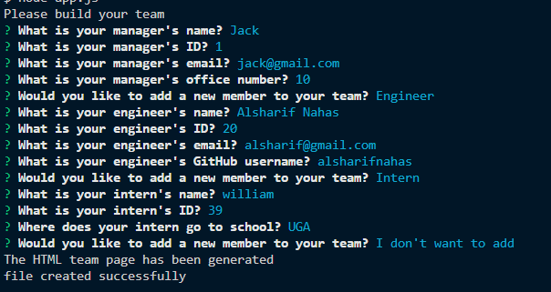
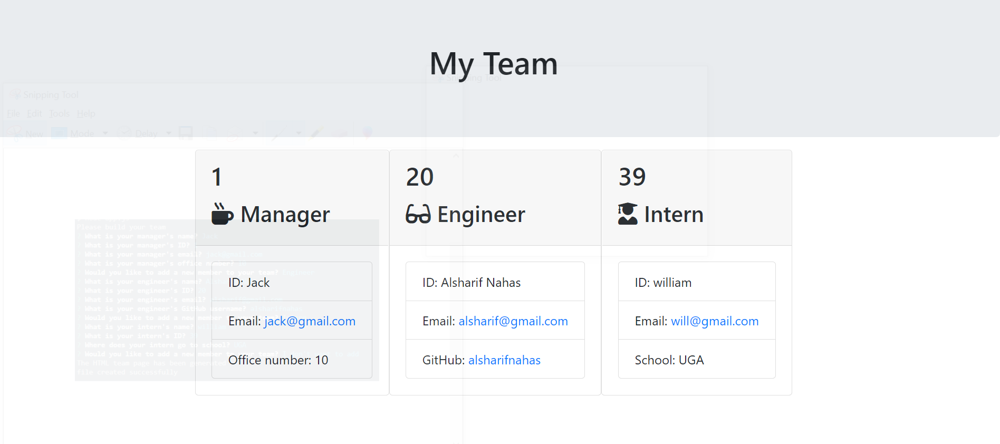

# team-roster-generator

## Description

A command line application that takes user input and generates an HTML document containing the team's information. The application is written using JavaScript and should be run using the node js.

## Table of Contents

- [Installation](#installation)
- [Usage](#usage)
- [License](#license)
- [Contributing](#contributing)
- [Tests](#tests)
- [Contact](#contact)

## Installation

Copy the link of the repository from the clone button, then run `git clone "the link of the repo"`. Once the repo cloned run the `npm install` to install all dependencies. Node js is required for this project.

## Usage

Run the command `node app.js` in the directory. Follow the question in order to collect all of the needed information. The application will generate a new `team.html`, in the `./output` folder




[Link to video demo](https://drive.google.com/file/d/1O1wUsOcER-NhlRI_sq6LkrSOiaTrilmN/view)

## License

This application is covered under MIT License

<details>
  <summary>
    License Text
  </summary>

```

Copyright (c) 2021  Pete Kriengsiri

Permission is hereby granted, free of charge, to any person obtaining a copy
of this software and associated documentation files (the "Software"), to deal
in the Software without restriction, including without limitation the rights
to use, copy, modify, merge, publish, distribute, sublicense, and/or sell
copies of the Software, and to permit persons to whom the Software is
furnished to do so, subject to the following conditions:

The above copyright notice and this permission notice shall be included in all
copies or substantial portions of the Software.

THE SOFTWARE IS PROVIDED "AS IS", WITHOUT WARRANTY OF ANY KIND, EXPRESS OR
IMPLIED, INCLUDING BUT NOT LIMITED TO THE WARRANTIES OF MERCHANTABILITY,
FITNESS FOR A PARTICULAR PURPOSE AND NONINFRINGEMENT. IN NO EVENT SHALL THE
AUTHORS OR COPYRIGHT HOLDERS BE LIABLE FOR ANY CLAIM, DAMAGES OR OTHER
LIABILITY, WHETHER IN AN ACTION OF CONTRACT, TORT OR OTHERWISE, ARISING FROM,
OUT OF OR IN CONNECTION WITH THE SOFTWARE OR THE USE OR OTHER DEALINGS IN THE
SOFTWARE.

```

</details>

## Contributing

No contributions are being accepted at this time.

## Tests

Run `npm test` to run tests via the npm jest package.

## Contanct

My Email [email](alsharifeid@gmail.com).
View my GitHub [profile](https://github.com/alsharifnahas).

© 2020 Alsharif Nahas. Confidential and Proprietary. All Rights Reserved.
